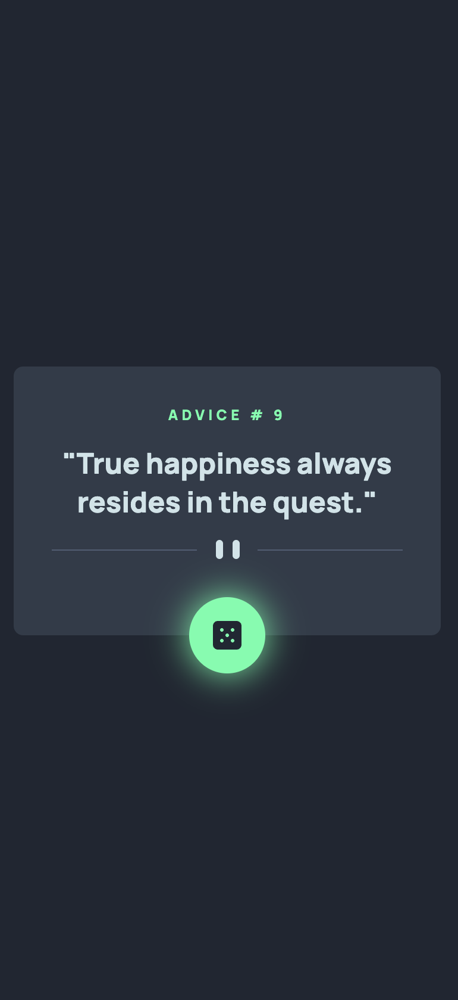
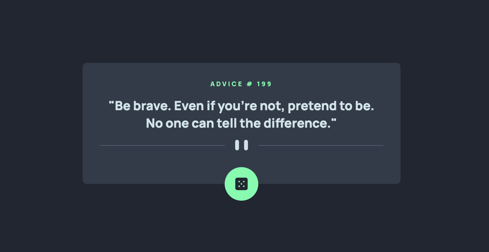

# Frontend Mentor - Advice generator app solution

This is a solution to the [Advice generator app challenge on Frontend Mentor](https://www.frontendmentor.io/challenges/advice-generator-app-QdUG-13db). Frontend Mentor challenges help you improve your coding skills by building realistic projects.

## Table of contents

- [Overview](#overview)
  - [The challenge](#the-challenge)
  - [Screenshot](#screenshot)
  - [Links](#links)
- [My process](#my-process)
  - [Built with](#built-with)
  - [What I learned](#what-i-learned)
  - [Continued development](#continued-development)
- [Author](#author)

## Overview

### The challenge

Users should be able to:

- View the optimal layout for the app depending on their device's screen size
- See hover states for all interactive elements on the page
- Generate a new piece of advice by clicking the dice icon

### Screenshot




### Links

<!-- - Solution URL: [Add solution URL here](https://your-solution-url.com) -->

- Live Site URL: [Advice Generator](https://vicschbt.github.io/PERSO-advice-generator-app/)

## My process

### Built with

- Semantic HTML5 markup
- CSS custom properties
- SCSS with BEM syntax
- Flexbox
- Mobile-first workflow
- Fetch API

### What I learned

This project was an opportunity to do a very simple fetch call to display the desired information.

```js
const getAdvice = async () => {
	const response = await fetch(ADVICE_URL);
	const data = await response.json();
	return data.slip;
};
```

### Continued development

The folling ideas can be used for extending this app:

- A favorite quote feature
- A daily quote

## Author

- Frontend Mentor - [@VicSchbt](https://www.frontendmentor.io/profile/VicSchbt)
- LinkedIn - [Victoire Schubert](www.linkedin.com/in/victoire-schubert)
- Instagram - [@vicschbt.codes](https://www.instagram.com/vicschbt.codes?igsh=OHczMzcwMWpjZm1p&utm_source=qr)
